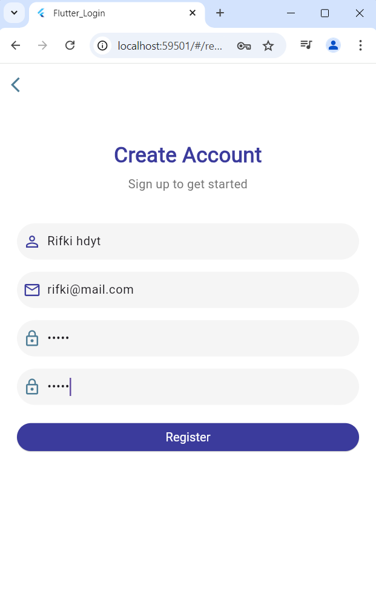
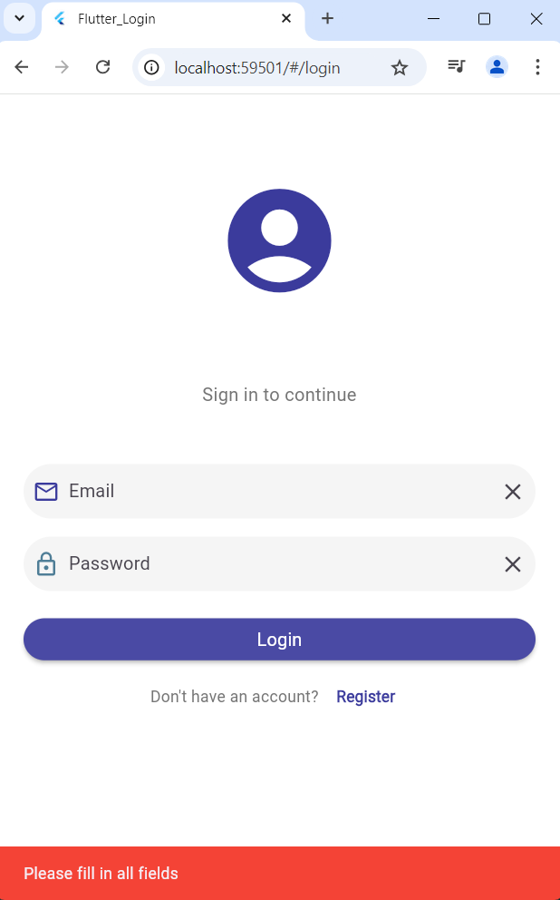
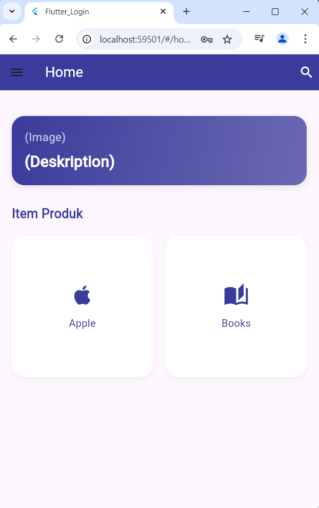
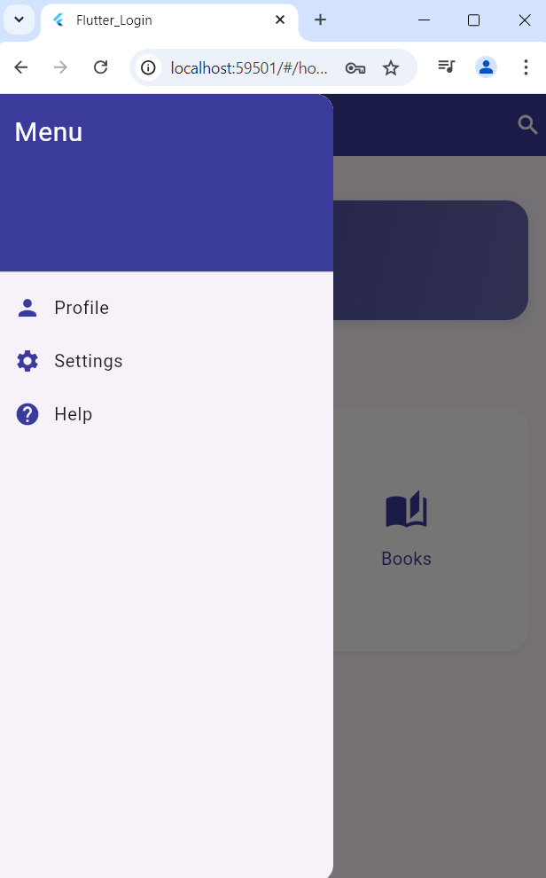
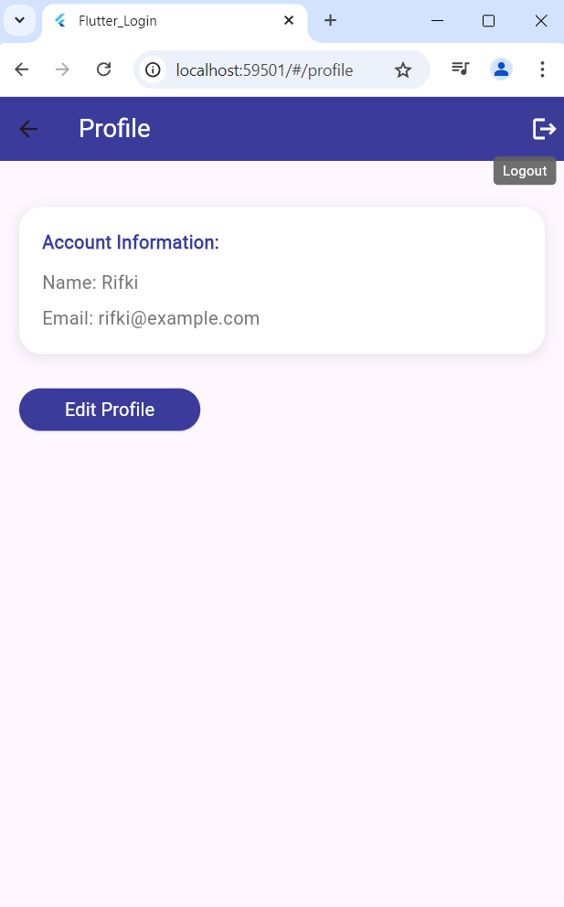

# flutter_login

---

### Ujian Tengah Semester (UTS)  

**Nama**  : RIFKI HIDAYAT
**Kelas** : 2D TRPL
**NIM**   : 2097
**Matkul** : Pemrograman Web Bergerak 

---

## Screanshoot

**halaman Register** : langkah awal pembuatan akun

_______________________________________________________

**halaman Login** : langkah untuk autentifikasi keamanan pengguna

_______________________________________________________

**halaman Home** : Tempat menampilkan Konten utama dan fitur yang tersedia

_______________________________________________________

**Navigasi Menu** : Digunakan untuk menyembunyikan menu yang lebih besar dan kompleks

_______________________________________________________

**Halaman Profile** : Digunakan untuk menampilkan informasi tentang pengguna, seperti data pribadi, preferensi, dan aktivitas mereka.

---

## Penjelasan

    Flutter adalah framework yang digunakan untuk mengembangkan aplikasi mobile dengan tampilan yang menarik dan performa yang baik. Salah satu fitur penting dalam banyak aplikasi adalah sistem login, yang memungkinkan pengguna untuk mengakses konten yang dilindungi atau personalisasi berdasarkan akun mereka.

---

## Kesimpulan

    Implementasi login di Flutter melibatkan pembuatan antarmuka pengguna yang sederhana, pengelolaan status login, dan navigasi antar halaman. Dengan menggunakan pendekatan yang tepat, Anda dapat membuat sistem login yang aman dan efisien untuk aplikasi Anda. Pastikan untuk selalu menangani kesalahan dan memberikan umpan balik yang jelas kepada pengguna.